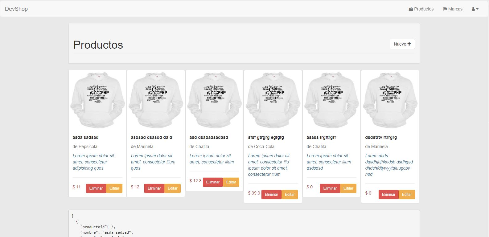
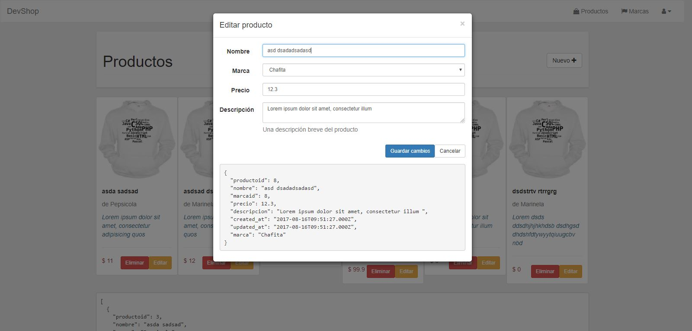
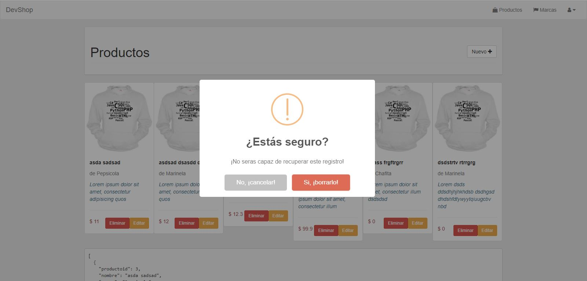

# CRUD Express + VueJS


## Historias de Usuario

### Usuarios pueden ver una lista productos

```
Cuando un usuario accede a '/productos'
será redireccionado al router GET de '/productos'  
todos los usuarios serán desplegados en forma de grilla
```



### Usuarios pueden crear productos

```
Cuando un usuario va al sitio de productos
Y pulsa el botón "Agregar un Producto"
El usuario podrá ver una ventana modal para crear un producto
Cuando el usuario pulse "Guardar registro" recibirá 
una notificación de que todo salio correcto y se actualiza el listado de productos
```


### Usuarios pueden actualizar productos

```
Cuando un usuario va al sitio de productos
Y pulsa el botón "Editar" de algún producto
El usuario podrá ver una ventana modal para editar el producto
Cuando el usuario pulse "Guardar cambios" recibirá 
una notificación de que todo salio correcto y se actualiza el listado de productos
```



### Usuarios pueden eliminar productos

```
Cuando un usuario va al sitio de productos
Y pulsa el botón "Eliminar" de algún producto
El usuario será advertido antes de eliminarlo
Cuando el usuario pulse "Si, ¡borrarlo!" recibirá 
una notificación de que todo salio correcto y se actualiza el listado de productos
```


